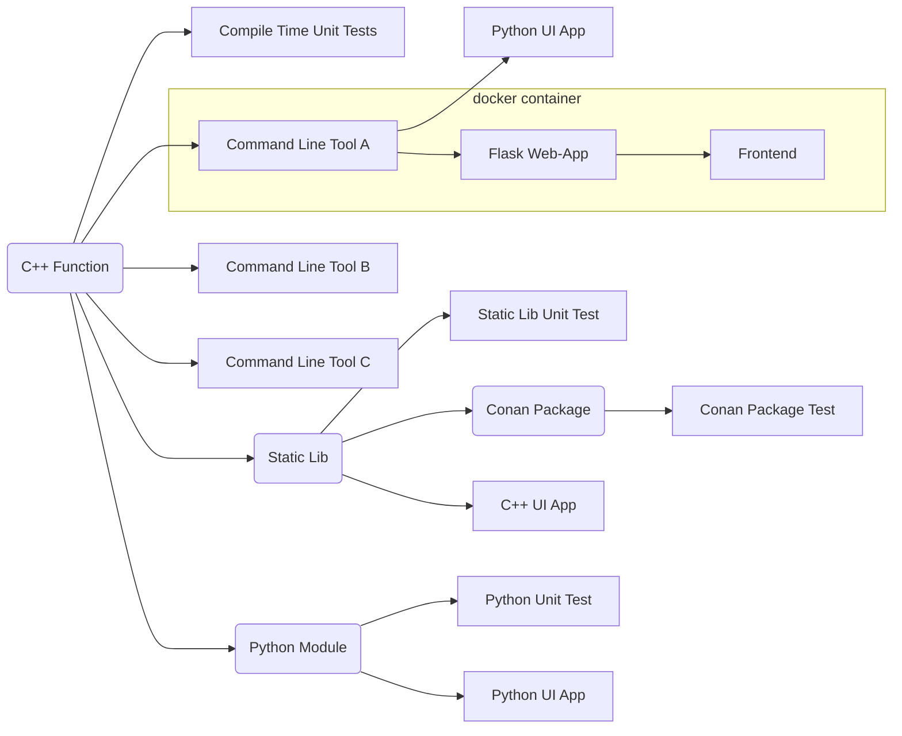

# About

Imagine you have a simple, nice, useful C++ function. How do you make it available to users?

# Content

The *full stack* contains:

* A C++ header-only library with a ``constexpr`` function.
* A compile-time unit test that tests the above function.
* A command line tool to process command line arguments using the function.
* A Python UI application that provides a front-end to this command-line tool.
* A command line tool to handle interactive data with the function.
* A command line tool to process the contents of a given file with the function.
* A static library that encapsulates the function.
* A unit test for this static library.
* A C++ QT5 UI application based on the static library.
* A *conan* package containing the static library.
* A test for this *conan* package.
* A Python-based Flask web application that provides a web interface and REST API to the above command line tool.
* A HTML/JavaScript front-end querying the above REST API.
* A Docker container containing the above Flask web application.
* A Python module implemented using the Python C API.
* A unit test that tests this module.
* A Python UI application that uses this module.





# Requirements

* Local execution of the web-app requires Python 3.8+.
* Python module creation requires Python installation with Python C API dependencies.
* *docker* to containerize the web app.
* *conan* to build the *conan* package.
* *QT5* to build the C++ QT UI app.


# Build

To build and test everything:

```
mkdir build
cd build
cmake -DADD_PYTHON_MODULE=ON  -DADD_QT_APP=ON ..
cmake --build . --config Release
ctest -C Release  -VV
cmake --install .
cd ..
python -m unittest discover src/test_py
docker build --tag title-case-web .
conan export-pkg . func_lib/0.1.0 --profile ./profile -f
conan test src/test_package/conanfile.py func_lib/0.1.0@func_lib/0.1.0 --profile ./profile
```

The collection of deliverables can be found in ```build/product```.

# Use


## Web-App

```
python web.py C:\web\resources C:\build\product
```

## Container

Build the image with:
```
docker build --tag title-case-web .
```
The multi-stage build process will build the ```cmdl``` tool.


Run the container with:
```
docker run --rm -it -p 5000:5000 title-case-web
```

Open ```localhost:5000``` for a synchronous web-app. Open ```localhost:5000/interactive``` for an asynchronous web-app.

# ToDo


