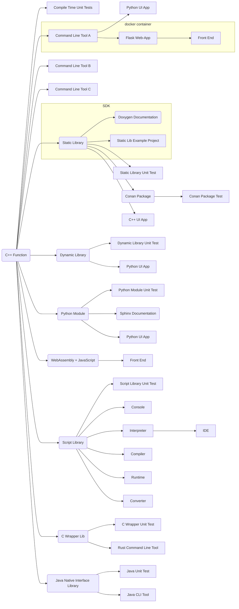

[](https://github.com/SebastianBach/full-stack/actions/workflows/build.yml)

# About

You have a simple, nice, useful C++ function. How do you make it available to users?

# Content

The *full stack* contains:

* A C++ header-only library with a ```constexpr``` function.
* A compile-time unit test that tests the above function.
* A command line utility to handle command line arguments to the function.
* A Python UI application that provides a front-end to this command-line tool.
* A command line tool to handle interactive data with the function.
* A command line tool to process the contents of a given file with the function.
* A static library encapsulating the function.
* A unit test for this static library.
* A sample project for this static library.
* A C++ QT5 UI application based on the static library.
* A *Conan 2* package containing the static library.
* A test for this *Conan* package.
* A dynamic library.
* A unit test for this dynamic library.
* A Python UI application that uses this dynamic library.
* A Python-based Flask web application that provides a web interface and REST API to the above command line tool.
* An HTML/JavaScript front-end that queries the above REST API.
* A *Docker* container containing the above Flask web application.
* A Python module implemented using the Python C API.
* A unit test that tests this module.
* A *Sphinx* documentation for this module.
* A Python UI application that uses this module.
* A WebAssembly binary library and associated JavaScript code.
* An HTML/JavaScript frontend that uses the above WebAssembly library.
* A static library that implements a custom scripting language.
* A unit test for this static library.
* A console application for that scripting language.
* An interpreter that executes scripts in the custom scripting language.
* A Python-based IDE front-end for this script interpreter.
* A compiler that converts scripts in the custom scripting language into bytecode.
* A runtime that executes this bytecode.
* A converter that creates Python or C++ code based on a given script written in the custom scripting language.
* A C-wrapper for the C++ function.
* A unit test that tests this C-wrapper.
* A *Rust* command line tool calling the C-wrapper function.
* A Java Native Interface Library to extend Java.
* A unit test for that library.
* A *Java* command line tool using that library.




# Dependencies

* Native execution of the web app and other Python apps requires requires Python 3.8+.
* Python module creation requires Python installation with Python C API dependencies.
* *docker* to containerize the web app and to build the WebAssembly library.
* *conan* to build the *conan* package.
* *Qt5* to build the C++ Qt UI app.
* *Rust* to build the Rust app.
* *Java* to build Java command line tool.


# Build

To build and test everything:

```
# build all C++ products
mkdir build
cd build
cmake -DADD_PYTHON_MODULE=ON -DADD_QT_APP=ON -DADD_RUST_APP=ON -DADD_PY_DOCS=ON -DADD_LIB_DOCS=ON -DADD_JAVA_APP=ON ..
cmake --build . -j --config Release
ctest -C Release  -VV
cmake --install .

# test lib example project
cd lib_example_build
cmake  ../product/lib/example
cmake --build . --config Release
ctest -C Release  -VV
cd ..
cd ..

# run Python unit tests
python3 -m unittest discover src/test_py

# build web app container
docker build --tag title-case-web .

# build and test conan package
conan export-pkg . 
conan list text_conversion
conan test ./src/test_package text_conversion/0.1.1

# build WebAssembly library
./build_wasm.sh
```

The collection of deliverables can be found in ```build/product```.

CMake options are:

- **ADD_PYTHON_MODULE**: To build the Python module (requires Python C API).
- **ADD_PY_DOCS**: To build the Python documentation (requires Sphinx).
- **ADD_LIB_DOCS**: To build the C++ library documentation (requires doxygen).
- **ADD_QT_APP**: To build a Qt5 UI app (requires Qt5).
- **ADD_RUST_APP**: To build the Rust command line tool (requires Rust).
- **ADD_JAVA_APP**: To build the Java command line tool (requires Java).

See also ```.github/workflows/build.yml```.

# Usage

## Command Line Tool *title_case*

This command line tool takes the given command line argument, converts the data, and prints the result to ```std::cout```.

```
title_case "this is some text"

# prints
This is Some Text
```

## Command Line Tool *title_case_console*

Interactive command line tool. Enter the text to convert or "exit" to end the program.

## Command Line Tool *title_case_files*

The first command line argument is the file to read the data from, the second is the file to save the result to.

```sh
title_case_file source_file.txt target_file.txt
```

## Web App

Start the ```web.py``` script by providing the location of the resource files and the folder containing the ```title_case``` tool.

```sh
python web.py C:\web\resources C:\build\product
```

Open ```localhost:5000``` for a synchronous web app. Open ```localhost:5000/interactive``` for an asynchronous web app.

## Container

Build the *docker* image with:

```sh
docker build --tag title-case-web .
```

The multi-stage build process will build the ```title_case``` tool and copy all necessary files.


To start the container, run:

```sh
docker run --rm -it -p 5000:5000 title-case-web
```

Open ```localhost:5000``` for a synchronous web app. Open ```localhost:5000/interactive``` for an asynchronous web app.


## WebAssembly

WebAssembly requires to access the HTML document via a web server. A simple server can be started with Python:

```sh
python -m http.server
```

Open ```http://localhost:8000/``` to start the WebAssembly app.


## Scripting Language

The domain-specific scripting language is a simple language designed to perform basic tasks. The language consists of five commands:

| Command | Operand (optional) | Description |
| --- | --- | --- |
| ```text``` | *text to load and store in memory* | Stores the given text in the program's memory. |
| ```process``` | - | Processes the text in memory. |
| ```print``` | - | Prints the text in memory to the screen. |
| ```load``` | *path to text file* | Reads the specified text file and stores the text in memory. |
| ```save``` | *path to text file* | Saves the text in memory to the specified text file. |

An example program is:

```
text this is a headline
process
print
```

This will print ```This Is a Headline```.

### Command Line Tool *console*

The scripting **console** allows to enter and execute code. The console application can be closed by entering ```exit``` or pressing ```CTRL+C```.

### Command Line Tool *interpreter*

The **interpreter** loads and executes a script stored in the specified source file.

```sh
interpreter script.txt
```

### Command Line Tool *compiler* & *runtime*

The **compiler** loads a source file and generates byte-code, that can be executed by the **runtime**.

```sh
compiler script.txt bytecode.code

runtime bytecode.code
```

### Command Line Tool *converter*

The **converter** loads a source file and generates equivalent C++ or Python source code.
In Python the generated code uses the ```text_conversion``` module, in C++ the generated code uses the static library.

```sh
converter script.txt python_script.py py
```

The arguments are:

* Path to the script source file.
* Path to the target file to create.
* The target language, either ```py``` for Python or ```cpp``` for C++.


## Java Command Line Tool

Execute the command line tool (JAR) like this:

```sh
java -jar text_conversion.jar "this is a headline"
```

Make sure the ```libjava_text_conversion``` shared library can be found by Java. Set the command line argument ```java.library.path``` if needed.
