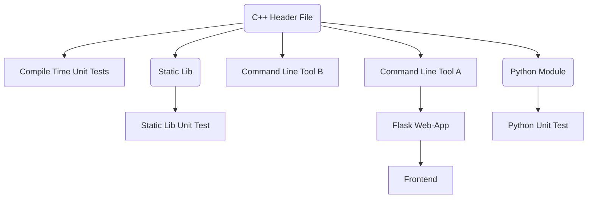

# About

Imagine you have a simple, nice, useful C++ function. How to you make this function available to users?

# Content

The *full stack* contains:

* C++ header-only library with ```constexpr``` function.
* Compile-time unit-tests testing the above function.
* Command line tool to process command line arguments using the function.
* Command line tool to process interactive data using the function.
* A static library encapsulating this function.
* A unit test for this static library.
* A Python based Flask web-app providing a web-interface for the above command line tool.
* A Python module, implemented using the Python C API.




# Requirements

* Web-app requires Python 3.8+
* Python module requires Python installation with Python C API


# Build

```
mkdir build
cd build
cmake .. 
cmake --build . --config Release --target compile_tests
cmake --build . --config Release --target cmdl
cmake --build . --config Release --target cmdl_interactive
cmake --build . --config Release --target func_lib
cmake --build . --config Release --target lib_test
cmake --build . --config Release --target python_module
ctest -C Release  -VV
cmake --install .
cd ..
python -m unittest discover src/test_py
```

# Use


## Web-App

```
python web.py C:\web\resources C:\build\product
```

# ToDo


