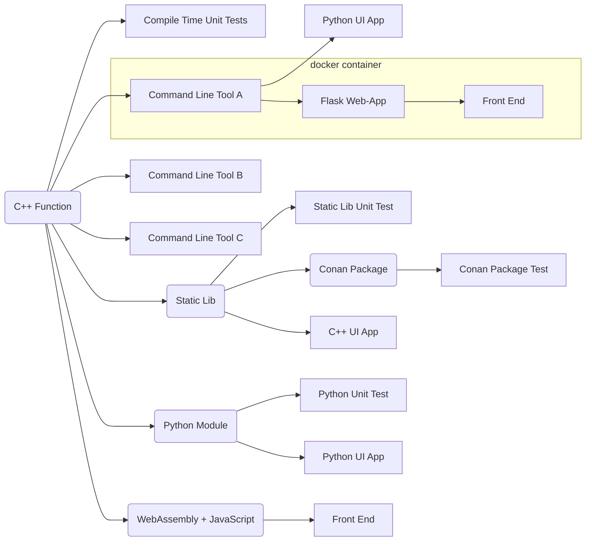

# About

You have a simple, nice, useful C++ function. How do you make it available to users?

# Content

The *full stack* contains:

* A C++ header-only library with a ``constexpr`` function.
* A compile-time unit test that tests the above function.
* A command line tool to process command line arguments using the function.
* A Python UI application that provides a front-end to this command-line tool.
* A command line tool to handle interactive data with the function.
* A command line tool to process the contents of a given file with the function.
* A static library that encapsulates the function.
* A unit test for this static library.
* A C++ QT5 UI application based on the static library.
* A *conan* package containing the static library.
* A test for this *conan* package.
* A Python-based Flask web app that provides a web interface and REST API to the above command line tool.
* A HTML/JavaScript front-end querying the above REST API.
* A Docker container containing the above Flask web application.
* A Python module implemented using the Python C API.
* A unit test that tests this module.
* A Python UI application that uses this module.
* A WebAssembly binary library and associated JavaScript code.
* A HTML/JavaScript front-end utilizing the above WebAssembly library.





# Dependencies

* Native execution of the web app and other Python apps requires requires Python 3.8+.
* Python module creation requires Python installation with Python C API dependencies.
* *docker* to containerize the web app and to build the WebAssembly library.
* *conan* to build the *conan* package.
* *Qt5* to build the C++ Qt UI app.


# Build

To build and test everything:

```
# build all C++ products
mkdir build
cd build
cmake -DADD_PYTHON_MODULE=ON  -DADD_QT_APP=ON ..
cmake --build . --config Release
ctest -C Release  -VV
cmake --install .
cd ..

# run Python unit tests
python -m unittest discover src/test_py

# build web app container
docker build --tag title-case-web .

# build and test conan package
conan export-pkg . -of ./build/conan
conan list text_conversion
conan test ./src/test_package text_conversion/0.1.1

# build WebAssembly library
./build_wasm.sh
```

The collection of deliverables can be found in ```build/product```.

CMake options are:

- **ADD_PYTHON_MODULE**: To build the Python module (requires Python C API)
- **ADD_QT_APP**: To build a Qt5 UI app (requires Qt5).

# Usage

## Command Line Tool *title_case*

This command line tool takes the given command line argument, converts the data, and prints the result to ```std::cout```.

```
title_case "this is some text"

# prints
This is Some Text
```

## Command Line Tool *title_case_console*

Interactive command line tool. Enter the text to convert or "exit" to end the program.

## Command Line Tool *title_case_files*

The first command line argument is the file to read the data from, the second is the file to save the result to.

```
title_case_file source_file.txt target_file.txt
```

## Web App

Start the ```web.py``` script by providing the location of the resource files and the folder containing the ```title_case``` tool.

```
python web.py C:\web\resources C:\build\product
```

Open ```localhost:5000``` for a synchronous web app. Open ```localhost:5000/interactive``` for an asynchronous web app.

## Container

Build the *docker* image with:

```
docker build --tag title-case-web .
```

The multi-stage build process will build the ```title_case``` tool and copy all necessary files.


To start the container, run:

```
docker run --rm -it -p 5000:5000 title-case-web
```

Open ```localhost:5000``` for a synchronous web app. Open ```localhost:5000/interactive``` for an asynchronous web app.


## WebAssembly

WebAssembly requires to access the HTML document via a web server. A simple server can be started with Python:

```
python -m http.server
```

Open ```http://localhost:8000/``` to start the WebAssembly app.
