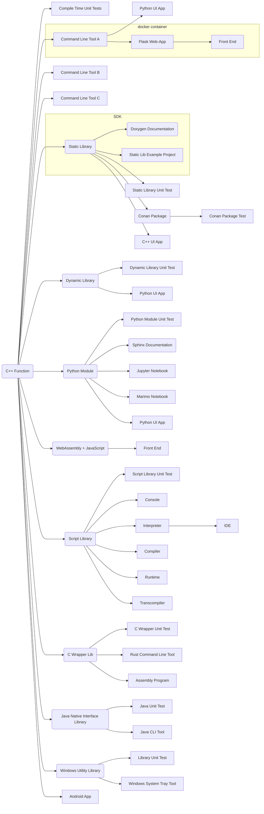

[](https://github.com/SebastianBach/full-stack/actions/workflows/build.yml)

Coverage: https://sebastianbach.github.io/full-stack/coverage.html

# About

You have a simple, nice, useful C++ function. How do you make it available to consumers?

# Content

The *full stack* contains:

* A C++ header-only library with a ```constexpr``` function.
* A compile-time unit test that tests the above function.
* A command line utility to handle command line arguments to the function.
* A Python UI application that provides a front-end to this command-line tool.
* A command line tool to handle interactive data with the function.
* A command line tool to process the contents of a given file with the function.
* A static library encapsulating the function.
* A unit test for this static library.
* A sample project for this static library.
* A C++ QT5 UI application based on the static library.
* A *Conan 2* package containing the static library.
* A test for this *Conan* package.
* A dynamic library.
* A unit test for this dynamic library.
* A Python UI application that uses this dynamic library.
* A Python-based Flask web application that provides a web interface and REST API to the above command line tool.
* An HTML/JavaScript front-end that queries the above REST API.
* A *Docker* container containing the above Flask web application.
* A Python module implemented using the Python C API.
* A unit test that tests this module.
* A *Sphinx* documentation for this module.
* A *Jupyter Notebook* showing how to use this module.
* a *marimo* notbook using this module.
* A Python UI application that uses this module.
* A WebAssembly binary library and associated JavaScript code.
* An HTML/JavaScript frontend that uses the above WebAssembly library.
* A static library that implements a custom scripting language.
* A unit test for this static library.
* A console application for that scripting language.
* An interpreter that executes scripts in the custom scripting language.
* A Python-based IDE front-end for this script interpreter.
* A compiler that converts scripts in the custom scripting language into bytecode.
* A runtime that executes this bytecode.
* A transcompiler that creates Python or C++ code based on a given script written in the custom scripting language.
* A C-wrapper library for the C++ function.
* A unit test that tests this C-wrapper library.
* A program written in Assembly language that utilizes this C-wrapper library.
* A *Rust* command line tool calling the C-wrapper library function.
* A Java Native Interface Library to extend Java.
* A unit test for that library.
* A *Java* command line tool using that library.
* A *Windows* utility library.
* A unit test for this utility library.
* A *Windows* system tray app using the utility library.
* An *Android* app.




# Dependencies

* Native execution of the web app and other Python apps requires requires Python 3.8+.
* Python module creation requires Python installation with Python C API dependencies.
* *docker* to containerize the web app and to build the WebAssembly library.
* *conan* to build the *conan* package.
* *Qt5* to build the C++ Qt UI app.
* *Rust* to build the Rust app.
* *Java* to build Java command line tool.


# Build

To build and test everything:

```
# build all C++ products
mkdir build
cd build
cmake -DCMAKE_BUILD_TYPE=Release    -DADD_BASIC_TOOLS=ON\
                                    -DADD_SDK=ON\
                                    -DADD_C_LIB=ON\
                                    -DADD_DYNAMIC_LIB=ON\
                                    -DADD_PYTHON_MODULE=ON\
                                    -DADD_QT_APP=ON\
                                    -DADD_RUST_APP=ON\
                                    -DADD_PY_DOCS=ON\
                                    -DADD_LIB_DOCS=ON\
                                    -DADD_SCRIPT_TOOLS=ON\
                                    -DADD_ASSEMBLY_PROGRAM=ON ..
cmake --build . -j --config Release
ctest -C Release  -VV
cmake --install .

# test lib example project
cd lib_example_build
cmake  ../product/lib/example
cmake --build . --config Release
ctest -C Release  -VV
cd ..
cd ..

# build web app container
docker build --tag title-case-web .

# build and test conan package
conan export-pkg . 
conan list text_conversion
conan test ./src/test_package text_conversion/0.1.1

# build WebAssembly library
./build_wasm.sh
```

The collection of deliverables can be found in ```build/product```.

CMake options are:

- **ADD_BASIC_TOOLS**: To build the basic command line tools.
- **ADD_SDK**: To build the static library and documentation.
- **ADD_C_LIB**: To build a static library with C interface.
- **ADD_DYNAMIC_LIB**: To build a dynamic library.
- **ADD_PYTHON_MODULE**: To build the Python module (requires Python C API).
- **ADD_PY_DOCS**: To build the Python documentation (requires Sphinx).
- **ADD_LIB_DOCS**: To build the C++ library documentation (requires doxygen).
- **ADD_QT_APP**: To build a Qt5 UI app (requires Qt5).
- **ADD_RUST_APP**: To build the Rust command line tool (requires Rust).
- **ADD_JAVA_APP**: To build the Java command line tool (requires Java).
- **ADD_SCRIPT_TOOLS**: To build the script tools.
- **ADD_ASSEMBLY_PROGRAM**: To build the Assembly program.
- **ADD_WIN_TOOLS**: To build Windows utilities.

See also ```.github/workflows/build.yml```.

# Usage

See the [user guide](user_guide.md) on how to use the included software.
